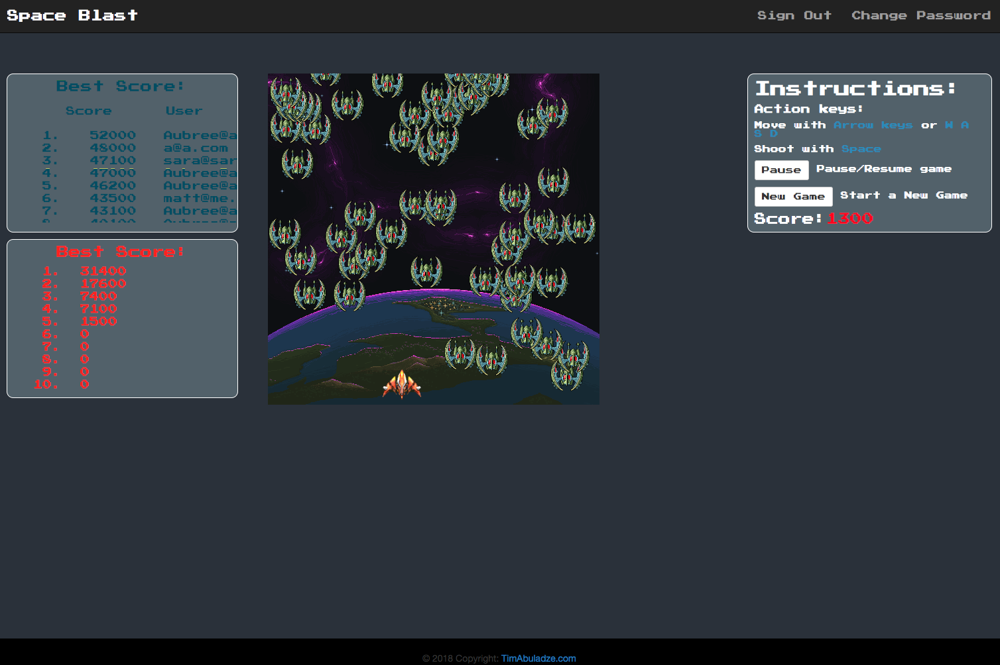

## Space Blast client side
Front end side of Old School game made with HTML canvas and Ruby on Rails for
back end. In the game you are able to controll little spaceship and shoot enemy.
Also view High Scores of other players. Gamelogic using Javascript to create
animation and position it on a canvas field. On creating and updating games and
also on user axtions Im sending CRUD request to back and. For example for
displaying high scores Im using data provided by GET request to display
information with handlebars. Enjoy Playing!

## Other Links
[Space Plast API repo](https://github.com/TimA89/Capstone_game_api)
[Deployed Front End](http://timabuladze.com/Capstone_game_client/)
[Deployed Back End](https://capstone-game.herokuapp.com/)

## Technologies Used
- Javascript
- HTML5/ Canvas
- jQuery
- Bootstrap/CSS/SCSS
- AJAX
- JSON
- Handlebars

## Unsolved Issues
- Styling of lower dimension view and mobile query
- Adding extra lives to player and levels to game
- pausing a game with P key

## Planning
My planning was mostly based around Game logic. First day I spent on reserches and stydiing og HTML canvas and how to use it. What kind of games can be done with it. Next two days i worked on game logic and function to upload pictures(picloader.js) to cache, so with every frame change pictures were ready to use and event listener for key buttons(input.js). After that 4th day I spent on Users CRUD and basic styling of page. When that was done I concentrated on Game CRUD and game UI's for another two days, during that time aI also changed layout of page and styling. I had couple major issues with cross-scripting and main game loop, which i was able to fix by console loging every little step of the way and debugger.

## Wireframes and User stoies
User stories:
- Clent wants to open a page and see Instructions and invitating words for game
- Client wants to be able to sign up with Email and password
- Client wants to be able to sign in with Email and password
- Client wants to be able to change password
- Client wants to be able to sign out
- Client wants to be able to press on a Play button to start a game
- Client wants to be able to pause/resume game at any time
- Client wants to be able to Start a new game at any time
- Client wants to be able to see score of the curent game
- Client wants to be able to see his High scores and Best High Scores over all

[WireFrame](https://imgur.com/VqL8qdp)

Game:

## Instructions
- Fork and clone this repository.
- Change into the new directory.
- Run npm install.
- Create and checkout a new branch.
- Open index.html to view HTML code
- assets/scripts contains javascript code
- assets/scripts/index.js main javascript function for homepage
- assets/scripts/game-actions game event listeners, api requests and ui's
- assets/scripts/user-actions user event listeners, api requests and ui's
- assets/scripts/templates contains Handlebars
- assets/scripts/gamelogic.js contains game logic
- assets/scripts/picloader.js contains pic loading functions
- assets/scripts/input.js contains key press event listeners
- assets/style/index.scss CSS/Bootstrap
